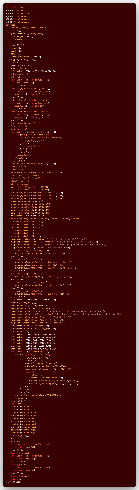
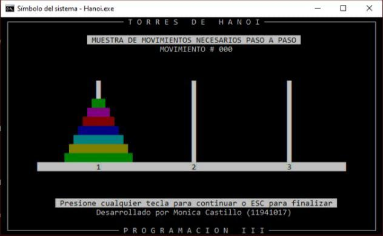

# C++_TDH3 (Incompleto)

## :copyright: Autor

- :camera:  
- :woman: **Mónica Valeria Castillo**
- :e-mail: monicastillo@unitec.edu
- :link: [github.com/monicastle](https://github.com/monicastle)
- :calendar: 15/09/2020

---

## :dart: Objetivos

Proyecto Torres de Hanoi (Parte 3) en **C++** diseñado para demostrar:

1. :books: Poner en practica un ejercicio clasico de programación que nos ayudará en:
   - **La Recursividad**
   - **Despliegue gráfico de la salida utilizando NCurses**
3. :open_file_folder:La organización de:
   - Código (**Visual Studio Code** y Repositorio en **Github**)
   - Imágenes (Extensión **Polacode** de **VSC**)
   - Formato (**Markdown** en **VSC**)

---

## :red_circle: Hanoi_muestra.cpp

## :purple_circle: Salida - Torres de Hanoi Graficamente NCurses

El proyecto solo muestra la salida estatica, no hace el movimiento de los discos. 

---

## :computer: Código

- :blue_book: [C_TDH3](https://github.com/monicastle/C_TDH3)

---
## :wrench: Herramientas
- :package: [Visual Studio Code](https://code.visualstudio.com/)
- :camera: [Polacode-2020 v0.5.2](https://github.com/jeff-hykin/polacode)
- :notebook: [Markdown Cheatsheet](https://github.com/adam-p/markdown-here/wiki/Markdown-Cheatsheet)
- :smile: [Emoji Cheat Sheet](https://www.webfx.com/tools/emoji-cheat-sheet/)
